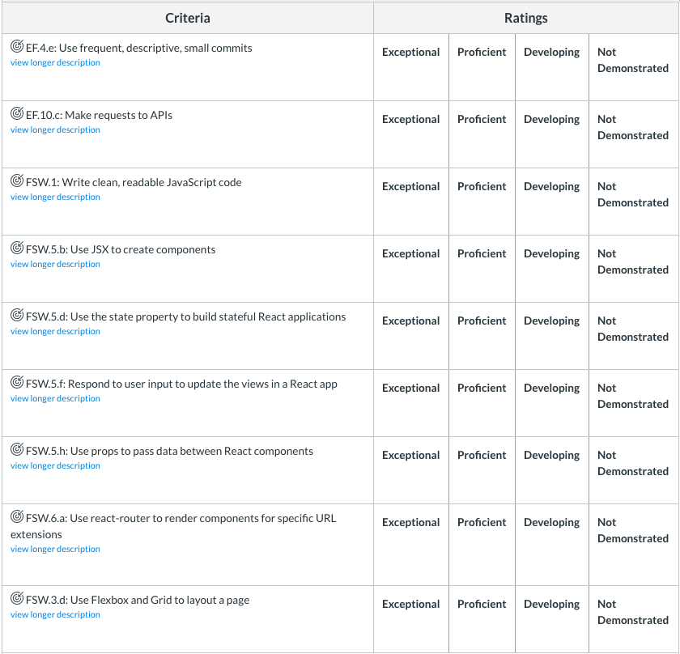

# Unit 4 Assessment

For this Assessment you will be building a simple YouTube client application. Your app will allow users to search for videos, watch a video and leave a comment for it.

## Task

- Create a React App with three pages; Home, Video and About
- You will use the official YouTube Data API v3. 
- Your app must make use of React Router for having multiple pages. 
- Your app may NOT use any other dependencies other than the following:
  - `react` and its accompanying libraries like `react-dom` and `react-scripts`.
  - `react-router-dom`
  - `react-youtube`
  - `axios`
  - [OPTIONAL] `bootstrap`, or equivalent UI frameworks like `semantic-ui-react` / `reactstrap`
  - Using anything else will mean your submission is incomplete

## Setup and the YouTube API

### API Key
  * To be able to make requests/calls to the YouTube API you will need to get an API key and use it in your network requests. Learn [How to get an API key here](how_to_get_youtube_api_key.md). Once obtained, the key needs to be used in a url [query parameter](https://en.wikipedia.org/wiki/Query_string#Structure) like so: `key=YOUR_API_KEY`. 
  * Once you receive the API Key put it inside of a file in `src/` that can be named `secrets.js` and export it like so:
  ```js
  // src/secrets.js
  const API_KEY = "YOUR_ACTUAL_API_KEY"
  export default API_KEY
  ```
  Then import your key as you would import anything else and use it as needed in your files. Make sure to add the name of this file to your `.gitignore` file so that it is not tracked by git and your API Key doesn't end up on GitHub (where it will be stolen).

### API Endpoints
  * YouTube API root endpoint: `https://www.googleapis.com/youtube/v3`
  * The two endpoints you will need are:
    * `GET` `/search` [Docs Here](https://developers.google.com/youtube/v3/docs/search/list)
    * `GET` `/videos` [Docs Here](https://developers.google.com/youtube/v3/docs/videos/list)

### Playing a Video
  * To embed the YouTube player and show a video in your application install and use the npm package `react-youtube`. As always read [its documentation](https://www.npmjs.com/package/react-youtube). The docs have an example of how to use this package and its component.

# The App

## Required Features
- Navbar with links
- Homepage with search form and results area
- Video page to play a video and leave comments
- About page with short description
- Should be styled to the best of your ability

### Navbar
- Must show on every page/route of the application.
- Shows a logo (In this case says Youtube)
- Shows links to the following pages:
  - Home
  - About


### Homepage `/`


- Shows a Search form with:
  - a search input Field
  - a search button
- Initially show a message like `No Search Results. Search for videos above!` in the place where the search results would later appear.
- Once the user enters a new search, they can press `Search` or `Enter` to get results. 

#### Search Results


- Once a user submits a search your app should replace the original `No search results` message with the results
- The results **MUST** me ordered in columns with **TWO** results per row
- Display the first 8 results. No pagination is needed. 
- For each video/result display:
  - The video thumbnail image
  - The title of the video
- Each video/result must be a link. Clicking on the video should take you to the Video page

### Video Page: `/video/:id`


- User should be able to access this page by any link to the specific video id
- Shows the YouTube player to show that specific YouTube video. Use `react-youtube` for this.
- Has a form below the video to submit a comment. The form will need:
  - A name input
  - A comment input
  - A submit button
- Adding a new comment in the form and pressing submit should add the comment to the list of comments.
- Form should check to see if user filled both files name and comment, if so allow the user to post the comment else alert the user asking to fill everything out.
- List the comments descending from newest to oldest. Last comment should appear at the top.
- Comments do not need to be persisted across pages or refreshes.
  - All the comments should just be stored in state for the moment.
  - If you refresh the page, all the comments would disappear and that is ok.
  - If you have extra time you can use LocalStorage to persist comments for videos.

### About Page: `/about`

- Show a header with the text **About**.
- Show a short description about what this app is about and who developed it.

## Rubric


